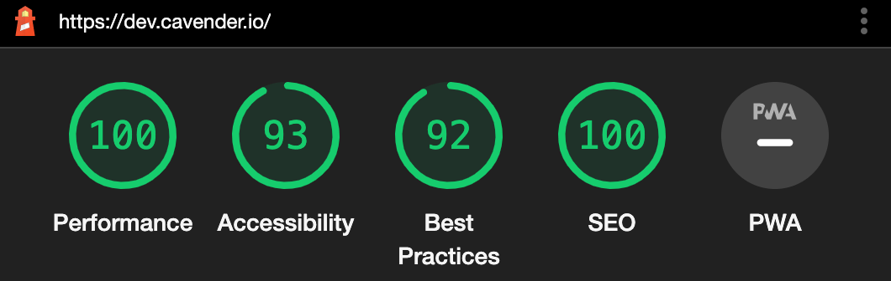

I started this blog in 2016 after a conversation with a coworker who blogs. He told me that the best developers are also bloggers. Hence, I dipped my foot into blogging. I didn't stick with it. However, I haven't given up. I have a list of topics I'd like to write about and even some drafts in progress. I hope you find something interesting to read while you're here.

## In The Beginning

When I started this project I wanted to get up and running fast. I wanted to start writing and get my content on the internet. Searching informed me that Jekyll was a go-to for many in this regard. I also stumbled upon a theme for a jekyll blog called [Minimal Mistakes](https://mmistakes.github.io/minimal-mistakes/). I followed the quick start guide and shortly had my own blog up and running.

## An Evolution

I wrote a total of 7 posts from starting the blog in 2016 to 2022. At the end of 22 I found an article about someone switching from jekyll to gatsby and MDX. So I looked those up and was very intrigued. I'd been working with react for the last couple years so a react-based blog was exciting. And did I mention it supports componentized markdown? Thus began a new project. Spinning up a blog with gatsby that supported MDX was easy. I was already really enjoying that development process. However, migrating my content proved painful. After a few attempts I figured it out and have not looked back.

## Lighthouse Score

